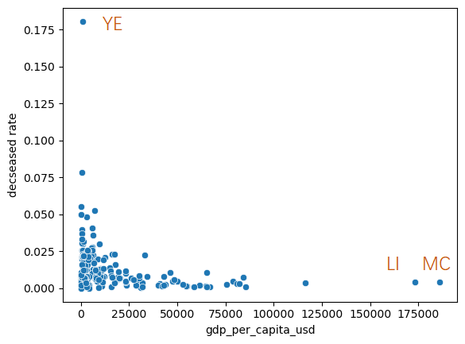
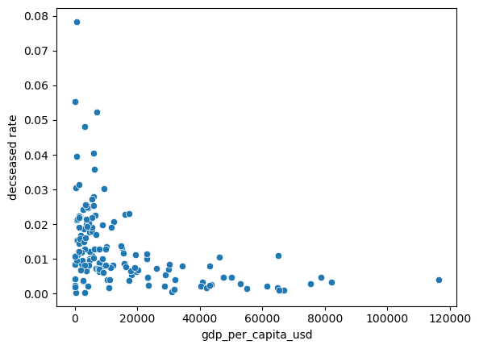

- vaccinations
	- 新确诊 v.s. 新接种人数
		- 
		- 
		- 
		- 
			- 相当一部分国家都在21年2-5月出现接种的第一个峰值
			- 两条曲线未发现明显相关性
	- 国家对于疫苗随着时间的新增接种情况, 可选国家及["new_persons_vaccinated","new_persons_fully_vaccinated","new_vaccine_doses_administered"]
		- 
		- 
		- 
		- 
	- 国家对于疫苗随着时间的累计接种情况, 可选国家及["cumulative_persons_vaccinated","cumulative_persons_fully_vaccinated","cumulative_vaccine_doses_administered"]
		- 
		- 
		- 
		- 
	- 第一、二、三针接种情况，可选国家
		- 
	- kde图展示全球的疫苗接种率，
		- 
			- 可以看出加强针的接种率还是偏低的，而第一针和第二针的接种率相差不大，均能达到80-90%左右
	- scatter plot （最新累计死亡率与第一针接种率）
		- 
		- 
			- 美洲及地中海地区在这两个参数上表现出相似的pattern
		- 
			- （除去other，只有一个数据）总体来说，西太平洋地区第一针接种率最高（均值81.90%），死亡率极值及平均值最小；非洲地区第一针接种率最低，均值仅37.54%
---
- sex 使用最新数据（可选数据：国家 y轴：cumulative confirmed, cumulative deceased, deceased rate
	- 死亡率
		- 
		- 
		- 
		- 
		- 
			- 在有数据的国家中，除了墨西哥，男性死亡率均高于女性
	- 确诊数
		- 
		- 
		- 
		- 
		- 
			- 有数据的大部分国家中，男女确诊数相差不大。且除去墨西哥及菲律宾，皆为女性确诊数大于男性

----
- age
	- 选出一些国家，不同年龄段确诊数量
		- 
			-
	- 使用最新数据 可选数据：国家 y轴：cumulative confirmed, cumulative deceased, deceased rate
		- 
		- 
		- 
		- 
		- 
		- 
			- Mortality increase sharply when aging
---
- GDP与死亡率（以国家为单位，取最新累计数据计算死亡率
	- 
	- 删掉这3个outliers 以及 总确诊数<40000 的国家
	- 
		- 总体来说，人均gdp越高，死亡率越低
---
- 健康相关因素与死亡率（以国家为单位，取最新累计数据计算死亡率
	- 吸烟率与死亡率
		- 
	- 糖尿病与死亡率
		- 
	- 均未见显著相关性
---
- clustering
	- 输入：预期寿命，吸烟率，糖尿病患病率，人均gdp，第一针疫苗接种人数（每100人）
	- 进行pca降维，与聚类
		- 
			- 聚类结果，基本依赖于x轴
		- 
			- 颜色深浅表示死亡率，可以看出虽然不太明显，但cluster0中的国家相对更高
		- 
			- 预期寿命，也是cluster0中的国家相对更浅，即相对寿命更低
		- 而其它cluster未表现出明显差异。基于此，将cluster0以外的国家汇成一组
			- cluster0中包含的国家
			- 
		- 
			- 其它指标都相差不大，唯独cluster0中国家的平均人均gdp远小于其它国家
-