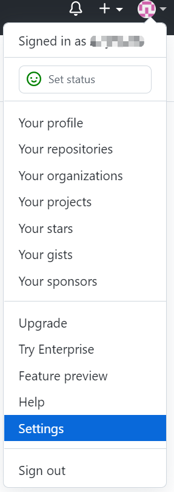
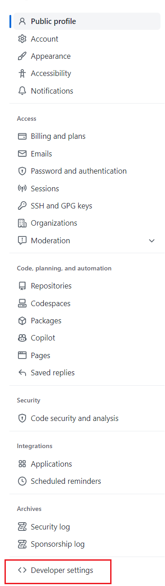
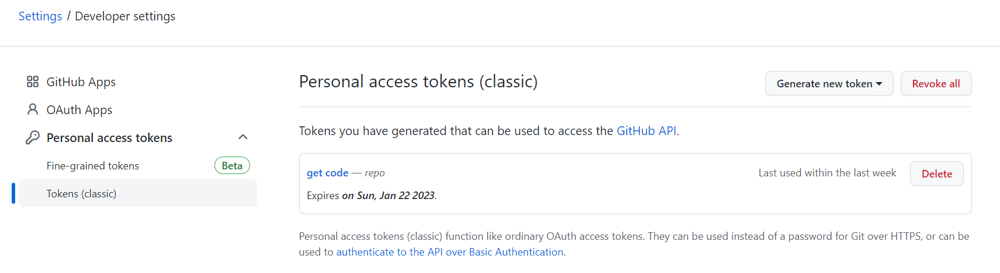

Something in the front: `<...>` represents words that should be replaced according to the situation. E.g. my user name in the computer is 'lenovo', so my home directory is `C:\Users\lenovo\`

1. Follow the instructions in courseware of week13
	- download [Git](https://git-scm.com)
	- generate the public key and add it to your GitHub account
2. Generate token of github (to push your commit to github)
	- Settings - Developer settings - Personal access tokens - Tokens (classic)
		-  
		- 
3. Set password-less push (optional)
	- create .git-credentials in your home directory
		- if you are using windows, that should be `C:\Users\<your user name>`
	- fill in `https://<your github name>:<token>@github.com` in .gitcredentials
	- type `git config --global credential.helper store` in your terminal
		- you can do this in Git-Bash
4. Now you have set up your computer to push your commit to our repository
	- First, `git clone https://github.com/Ally-Vella/MED5018-project.git`
		- And you can find the folder named `MED5018-project` in the directory
	- (I think using branches is too difficult, so let's just make our changes in the master branch. So do not change others' code 233333) If you make some changes or add more files, add them using `git add <filename>`
	- then `git commit -m "some commit message"`, you can write what you have done in this commit here inside the quotation mark
	- afterthat, `git push` (if this is the first time you push, using `git push -u` instead)
	- And you can find your changes in github!
	- IMPORTANT!! Everytime before you start your work, `git pull` first to get the newest version.
